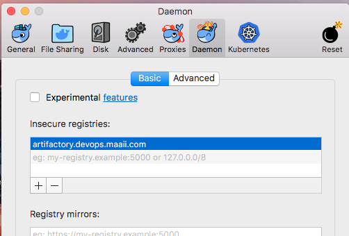
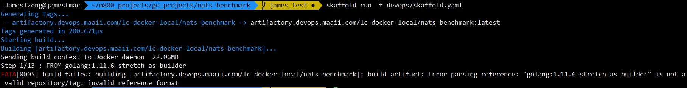
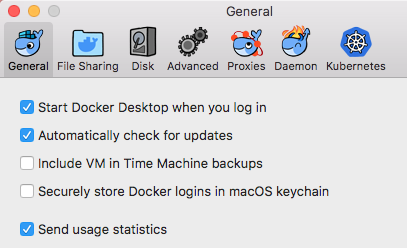

# CICD integration

This file describe how we develop and cooperate with DevOps progress. You can check [Makefile](../Makefile) for all commands in this document.

## Prerequisite

* Docker version `18.+`
* Skaffold `v0.26.0`

  ```bash
  # Linux
  curl -Lo skaffold https://storage.googleapis.com/skaffold/releases/v0.26.0/skaffold-linux-amd64 && chmod +x skaffold && sudo mv skaffold /usr/local/bin

  # macOS
  curl -Lo skaffold https://storage.googleapis.com/skaffold/releases/v0.26.0/skaffold-darwin-amd64 && chmod +x skaffold && sudo mv skaffold /usr/local/bin

  # Windows
  https://storage.googleapis.com/skaffold/releases/v0.26.0/skaffold-windows-amd64.exe
  ```

* Kustomize `v2.0.3`

  ```bash
  # Linux
  curl -Lo kustomize https://github.com/kubernetes-sigs/kustomize/releases/download/v2.0.3/kustomize_2.0.3_linux_amd64 && sudo chmod +x kustomize && sudo mv kustomize /usr/local/bin

  # macOS
  curl -Lo kustomize https://github.com/kubernetes-sigs/kustomize/releases/download/v2.0.3/kustomize_2.0.3_darwin_amd64 && sudo chmod +x kustomize && sudo mv kustomize /usr/local/bin

  # Windows
  https://github.com/kubernetes-sigs/kustomize/releases/download/v2.0.3/kustomize_2.0.3_windows_amd64.exe
  ```

## Docker

  There are some tricks in [Dockerfile](Dockerfile) and [.dockerignore](../.dockerignore) that helps build docker images faster.

* Use two-stage build in `Dockerfile`, and copy the less change files first. For example, copy the vendor directory first in Golang project. It will help to create some cached layers. (To use two-stage Dockerfile, Docker version 18.00+ is required)

* Add `.dockerignore` file. Write down anything that is not related to generate a build. For example: `devops` directory, `.git` directory, markdown files, binaries and so on.

---

We use artifactory as docker registry now. There are some steps to do:

### Add insecure private registry in local docker daemon and restart

* macOS: change in UI

  

  or add json in `~/.docker/daemon.json` and restart docker daemon

  ```json
  {
    "insecure-registries" : [
      "artifactory.maaii.com"
    ]
  }
  ```

* Linux: add json in `/etc/docker/daemon.json` and restart docker daemon

  ```json
  {
    "insecure-registries" : [
      "artifactory.maaii.com"
    ]
  }
  ```

### Login to artifactory

We only grant `lc-docker-local` directory permission to developers now. Please check if your docker images naming is in the right place.

Please login with following manner:

    docker login artifactory.maaii.com
---

    user: lcc5
    password: lcc5cake

## Kustomize

We use [kustomize](https://github.com/kubernetes-sigs/kustomize) as our K8s yamls generator.

We propose to use a tool called [kustomize](https://github.com/kubernetes-sigs/kustomize). The main difference between `kustomize` and `helm` is template, the base of helm is template while the base of kustomize is still usable resources！ This feature makes collaboration more easier. Developers don't need to understand another domain-specific language (DSL) or template system. If the base configuration could work on local Kubernetes cluster, it should work after environments patches of OP team.

We can have the base layer which is maintained by developers. Possible folder structure like this:

```shell
.
└── devops
    ├── Dockerfile
    └── base
        ├── kustomization.yaml
        ├── deployment.yaml
        └── service.yaml
```

Then we can generate K8s resource yamls by command `kustomize build devops/base`. The generated yamls will include the deployment and service resources. You can deploy them by:

    kustomize build devops/base | kubectl apply -f -

and delete them by:

    kustomize build devops/base | kubectl delete -f -

## Skaffold

[Github repository](https://github.com/GooglecontainerTools/skaffold)

Skaffold is a command line tool that facilitates continuous development for Kubernetes applications. Skaffold is the easiest way to share your project with the world: `git clone` and `skaffold run`

### How to use it

Create a develop-usage [kustomization.yaml](kustomization.yaml) in devops directory.

```bash
# Folder structure
.
└── devops
    ├── Dockerfile
    ├── base
    │   ├── kustomization.yaml  # This is for formal deployment
    │   ├── deployment.yaml
    │   └── service.yaml
    ├── kustomization.yaml  # This is for testing deployment
    └── skaffold.yaml  # Use testing kustomization.yaml
```

```yaml
# devops/kustomization.yaml

# These fields are required
namePrefix: test-
nameSuffix: -yourname
commonLabels:
  testing: "true"

# Use formal kustomize base block to deploy
bases:
  - base/  
```

Then create a develop-usage [skaffold.yaml](skaffold.yaml) in devops directory.

```yaml
# devops/skaffold.yaml

apiVersion: skaffold/v1beta7
kind: Config
build:
  tagPolicy:
    sha256: {}
  artifacts:
  - image: artifactory.maaii.com/lc-docker-local/go-project-template # Please change the project name
    docker:
      dockerfile: devops/Dockerfile # locates the Dockerfile relative to workspace.
      target:
deploy:
  kustomize:
    path: devops/
```

If we want build image, push image and deploy to K8s.

    skaffold run -f devops/skaffold.yaml

And delete all resources we just deployed on K8s.

    skaffold delete -f devops/skaffold.yaml

We can go into develop mode by using skaffold. With following command, skaffold will do everything as `skaffold run`. It also help to port-forward pods to local with random port, and you can press any key to rebuild/redeploy the changes.

    skaffold dev -f devops/skaffold.yaml --trigger manual

### Note

Then we can deploy your local testing service by `skaffold run -f devops/skaffold.yaml`

* If you want to deploy formal version of service, use `kustomize build devops/base/ | kubectl app -f -`

* **Always** use `latest` tag to save docker registry spaces. If you need to know what commit is in current deployment, add commit information in Kubernetes `annotation`.

## Troubleshooting

Q1: build artifact: Error parsing reference: "golang:1.11.6-stretch as builder" is not a valid repository/tag:invalid reference format



A1: Update Docker version to `18.+` and restart docker daemon

Q2. build artifact: Get https://artifactory.maaii.com/v2/: x509: certificate signed by unknown authority

A2: Add artifactory.maaii.com in insecure registry list in docker daemon and restart

* macOS: change in UI

  

  or add json in `~/.docker/daemon.json` and restart docker daemon

  ```json
  {
    "insecure-registries" : [
      "artifactory.maaii.com"
    ]
  }
  ```

* Linux: add json in `/etc/docker/daemon.json` and restart docker daemon

  ```json
  {
    "insecure-registries" : [
      "artifactory.maaii.com"
    ]
  }
  ```

Q3. Error saving credentials: error storing credentials - err: exit status 1, out:

A3: two possible solutions ([Reference Link](https://github.com/docker/for-mac/issues/2295)):

* Delete `/usr/local/bin/docker-credential-osxkeychain`
* Cancel `Securely store Docker logins in macOS keychain` checkbox
    